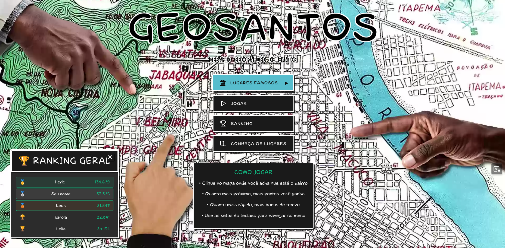
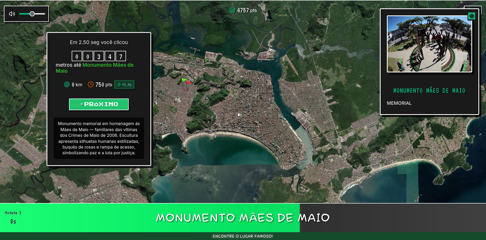
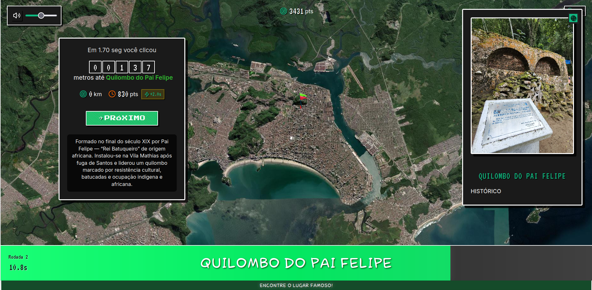
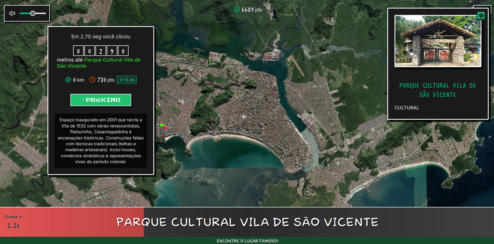

# GeoSantos
Jogo educativo sobre a cidade de Santos (SP)

## VISÃO GERAL

GeoSantos é um jogo casual educativo e acessível via navegador. Nele os jogadores precisam localizar bairros e locais importantes no território do município de Santos, SP. Em mapa interativo, o jogador clica no ponto que acredita ser o correto. A pontuação é baseada na distância em relação à localização real e no tempo de resposta. Funciona direto no navegador (em computadores) — sem necessidade de instalar nada. 

**🎮 Acesse o jogo:** https://hericmr.github.io/geosantos/


*Interface principal do jogo GeoSantos - Desafio Geográfico de Santos*

---

## Sobre os dados incluídos no jogo e a pesquisa feita

Os locais registrados no GeoSantos são pontos importantes da cidade de Santos que evidenciam territorialidades, lutas e conquistas dos movimentos sociais e da população local. O jogo destaca a presença de equipamentos sociais, culturais, religiosos, políticos e educacionais, como escolas, unidades de saúde, assistência social, espaços culturais e de lazer, além de comunidades e locais carregados de memória e história.

Entre os elementos mapeados, encontram-se narrativas relacionadas à escravidão e às lutas do povo negro, à resistência contra a ditadura empresarial-militar (1964-1984) e aos movimentos que moldaram e continuam a moldar a identidade da região.

Os materiais cartográficos e textuais disponíveis foram produzidos pelas(os) estudantes de Serviço Social da UNIFESP, dos turnos vespertino e noturno, durante a Unidade Curricular de Política Social 2, nos anos de 2024 e 2025, ministrada pela professora Dra. Tania Diniz.

---

## Gameplay - Modo Lugares Famosos

O modo "Lugares Famosos" desafia os jogadores a localizar pontos turísticos, monumentos históricos e locais importantes de Santos. Veja como funciona:

### Interface do Jogo


*Localizando o Monumento Mães de Maio - Memorial em homenagem às vítimas dos Crimes de Maio de 2006*


*Encontrando o Parque Cultural Vila de São Vicente - Reconstrução da Vila de 1532*


*Localizando o Quilombo do Pai Felipe - Comunidade histórica de resistência cultural*


## Locais presentes no jogo GeoSantos

| Local | Categoria |
|-----------------------------|---------------------------------------------|
| Engenho dos Erasmos | Histórico |
| Escultura 100 Anos da Imigração Japonesa | Monumento |
| Museu de Pesca | Museu |
| Teatro Coliseu | Cultura |
| Bolsa Oficial de Café | Histórico |
| Lagoa da Saudade | Turismo |
| Quilombo do Jabaquara | Histórico / Comunidades |
| Palmares Skate Park | Esporte |
| Praça Zumbi dos Palmares | Cultura |
| Monumento Mães de Maio | Memorial |
| Orquidário Municipal | Turismo |
| Aquário Municipal | Turismo |
| Basílica de Santo Antônio do Embaré | Igreja / Religioso |
| Quilombo do Pai Felipe | Histórico / Comunidades |
| Cadeia Velha (Casa de Câmara e Cadeia) | Cultura / Histórico |
| Farol Quebrado do Canal 6 | Histórico |
| O Portuário | Histórico |
| Ilha Urubuqueçaba | Ilha / Natureza |
| Casa da Frontaria Azulejada | História / Arquitetura / Cultura |
| Morro da Asa Delta (Morro do Voturuá) | Mirante / Esporte |
| Burakos Bar | Cultura Alternativa / Bar / Música |
| Ilha Diana | Cultura / Natureza / Comunitário |
| Teatro Municipal de Santos | Cultura / Teatro |
| Casa do Trem Bélico | Fortificação / Histórico |
| Outeiro de Santa Catarina | Marco Histórico |
| Parque Cultural Vila de São Vicente | Cultural |
| Ponte Pênsil de São Vicente | Engenharia / Histórico |
| Memorial dos 500 Anos | Monumento |
| Vila Belmiro (Estádio Urbano Caldeira) | Esportivo / Cultural |
| Praça da Biquinha de Anchieta | Histórico / Fonte |
| Casa Martim Afonso | Patrimônio Histórico |
| Catedral de Santos | Religioso |
| Fortaleza da Barra Grande | Fortificação / Histórico |
| Igreja Nossa Senhora do Carmo | Religioso |
| CRAS Zona da Orla e Intermediária | Assistência Social |
| Policlínica Campo Grande | Assistência Social |
| Policlínica Aparecida | Assistência Social |
| Policlínica e Pronto Atendimento do Porto - UBS Pa-Porto | Assistência Social |
| Policlínica Jabaquara - Unidade Saúde da Família Jabaquara | Assistência Social |
| Santa Casa da Misericórdia de Santos | Assistência Social |
| Fonte do Sapo | Lazer |
| Vila Sapo | Comunidades |
| Cinema no Gonzaga - Cine arte Posto 4 | Lazer |
| Estádio Urbano Caldeira - Vila Belmiro | Lazer / Esportivo |
| Trabulsi | Comunidades |
| Teatro Patrícia Galvão | Lazer / Cultura |
| Chorinho no Aquário | Lazer |
| Sesc - Santos | Lazer |
| Estátua de Iemanjá - Rainha do Mar | Histórico / Cultural |
| Terra Indígena Paranapuã | Comunidades / Histórico |
| Complexo esportivo e recreativo Rebouças | Lazer / Esporte |
| Biblioteca Municipal "Mário Faria" | Lazer / Cultura |
| Concha Acústica | Lazer / Cultura |
| Praça do Sesc Santos | Lazer |
| Pinacoteca Benedicto Calixto | Lazer / Cultura |
| Ponte dos Práticos | Histórico |
| Marco Oficial do Quilombo do Jabaquara | Histórico / Comunidades |
| Gonzaga | Bairro |
| Praça Palmares | Lazer |

---

## 🛠️ Tecnologias Utilizadas

[](https://hericmr.github.io/geosantos/)
[](https://reactjs.org/)
[](https://www.typescriptlang.org/)
[](https://leafletjs.com/)

### Frontend
- **React 18.2.0** - Framework principal
- **TypeScript 5.8.2** - Tipagem estática
- **Vite 6.2.2** - Build tool e dev server
- **Leaflet 1.9.4** - Biblioteca de mapas
- **React Leaflet 4.2.1** - Integração React-Leaflet
- **Lucide React 0.525.0** - Ícones modernos

### Backend & Dados
- **Supabase** - Backend as a Service
- **GeoJSON** - Dados geográficos dos bairros
- **Turf.js** - Análise geoespacial

### Testes
- **Vitest** - Framework de testes
- **React Testing Library** - Testes de componentes
- **Jest DOM** - Matchers para DOM

---

## 📁 Estrutura do Projeto

```
geosantos/
├── src/
│   ├── components/
│   │   ├── game/           # Componentes específicos do jogo
│   │   ├── ui/             # Componentes de interface
│   │   ├── Game.tsx        # Componente principal do jogo
│   │   └── Map.tsx         # Componente do mapa
│   ├── hooks/              # Custom hooks
│   ├── types/              # Definições TypeScript
│   ├── utils/              # Utilitários
│   ├── constants/          # Constantes do jogo
│   ├── lib/                # Configurações externas
│   └── styles/             # Estilos globais
├── public/
│   ├── assets/             # Recursos estáticos
│   └── data/               # Dados dos bairros
└── docs/                   # Documentação
```

---

## 🚀 Como Executar Localmente

### Pré-requisitos
- Node.js 18+ 
- npm ou yarn

### Instalação
```bash
# Clone o repositório
git clone https://github.com/hericmr/geosantos.git
cd geosantos

# Instale as dependências
npm install

# Execute em modo desenvolvimento
npm run dev
```

# 🤝 Contribuindo

O jogo ainda está em uma versão inicial. Sugestões e contribuições são mais que bem-vindas! Encontrou um problema ou tem uma ideia para melhorar o jogo? Abra uma issue ou envie uma pull request. Esse é um jogo de código aberto e a sua ajuda é fundamental para tornar "GeoSantos" ainda melhor!

A lógica desse jogo também pode ser usada em jogos de outras naturezas como aprendizado de anatomia, biologia, astronomia... o céu é o limite.

### Como Contribuir
1. Fork o projeto
2. Crie uma branch para sua feature (`git checkout -b feature/AmazingFeature`)
3. Commit suas mudanças (`git commit -m 'Add some AmazingFeature'`)
4. Push para a branch (`git push origin feature/AmazingFeature`)
5. Abra um Pull Request

---

## 👨‍💻 Autor

**Héric Moura**
- GitHub: [@hericmr](https://github.com/hericmr)
- LinkedIn: [Héric Moura](https://www.linkedin.com/in/heric-moura/)


**🎮 Espero que vcs se divirtam jogando como eu me diverti fazendo!** 🗺️

