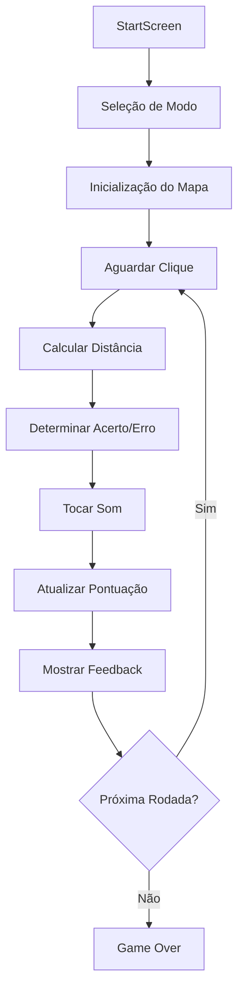

# 🎮 Lógica do Jogo Geosantos

## 📋 Resumo Executivo

O **Geosantos** é um jogo de geolocalização educacional que testa o conhecimento dos jogadores sobre a geografia de Santos-SP. O jogo funciona em dois modos principais:

### 🎯 **Modo Bairros**
- O jogador deve clicar no bairro correto de Santos
- Sistema de pontuação baseado em distância e tempo
- Feedback visual e sonoro baseado na precisão do clique

### 🏛️ **Modo Lugares Famosos**
- O jogador deve localizar pontos turísticos e lugares históricos
- Critério de acerto: distância ≤ 100m do local
- Sistema de pontuação competitivo similar ao modo bairros

### 🔊 **Sistema de Áudio**
- **`sucess.mp3`**: Toca quando distância ≤ 500m
- **`error.mp3`**: Toca quando distância ≥ 700m
- **Zona neutra**: Entre 500m-700m (apenas feedback visual)

---

## 🔧 Arquitetura Detalhada

### 1. **Estrutura Principal**

```
src/
├── components/
│   ├── Game.tsx              # Componente principal do jogo
│   ├── Map.tsx               # Renderização do mapa Leaflet
│   └── ui/                   # Interface do usuário
├── hooks/
│   ├── useGameState.ts       # Gerenciamento de estado global
│   └── useMapGame.ts         # Lógica principal do jogo
├── utils/
│   ├── gameConstants.ts      # Constantes do jogo
│   └── gameUtils.ts          # Funções utilitárias
└── types/
    └── game.ts              # Tipos TypeScript
```

### 2. **Fluxo de Jogo**



---

## 🎯 Lógica de Jogo Detalhada

### **1. Sistema de Pontuação**

#### **Modo Bairros**
```typescript
// Pontuação baseada em distância e tempo
const calculateScore = (distance: number, timeLeft: number) => {
  const distanceKm = distance / 1000;
  const distanceScore = Math.max(0, 1000 * (1 - (distanceKm / 10)));
  const timeBonus = timeLeft <= 2 ? Math.round((timeLeft / 2) * 500) : 0;
  return Math.round(distanceScore + timeBonus);
};
```

**Fórmula:**
- **Pontuação Base**: Máximo 1000 pontos para distância = 0m
- **Penalidade de Distância**: Linear até 10km (0 pontos)
- **Bônus de Tempo**: Até 500 pontos se tempo ≤ 2s

#### **Modo Lugares Famosos**
```typescript
// Sistema competitivo para lugares famosos
const calculateScore = (distance: number, timeLeft: number) => {
  const distanceKm = distance / 1000;
  const distanceScore = Math.max(0, 2000 * (1 - (distanceKm / 3)));
  const timeBonus = timeLeft <= 5 ? Math.round((timeLeft / 5) * 1000) : 0;
  return Math.round(distanceScore + timeBonus);
};
```

**Fórmula:**
- **Pontuação Base**: Máximo 2000 pontos para distância = 0m
- **Penalidade de Distância**: Linear até 3km (0 pontos)
- **Bônus de Tempo**: Até 1000 pontos se tempo ≤ 5s

### **2. Critérios de Acerto**

#### **Modo Bairros**
```typescript
// Acerto: Clique dentro do polígono do bairro
const isCorrectNeighborhood = clickedNeighborhood === currentNeighborhood;
if (isCorrectNeighborhood) {
  // Acerto perfeito - pontuação máxima
  const score = 3000 * Math.pow(timeLeft / 10, 2);
}
```

#### **Modo Lugares Famosos**
```typescript
// Acerto: Distância ≤ 100m do local
const distance = calculateDistance(clickPosition, targetPosition);
const isCorrectPlace = distance <= 100; // 0.1km
```

### **3. Sistema de Áudio**

```typescript
// Lógica de sons baseada em distância
if (successSoundRef.current && (isCorrectPlace || distance <= 500)) {
  successSoundRef.current.play(); // sucess.mp3
}

if (errorSoundRef.current && !isCorrectPlace && distance >= 700) {
  errorSoundRef.current.play(); // error.mp3
}
```

**Zonas de Feedback:**
- **✅ Verde (0-500m)**: Som de sucesso
- **🟡 Neutro (500-700m)**: Apenas feedback visual
- **❌ Vermelho (700m+)**: Som de erro

### **4. Gerenciamento de Estado**

#### **Estado Principal (GameState)**
```typescript
interface GameState {
  currentNeighborhood: string;      // Bairro atual
  score: number;                    // Pontuação total
  globalTimeLeft: number;           // Tempo global do jogo
  roundTimeLeft: number;            // Tempo da rodada atual
  roundInitialTime: number;         // Tempo inicial da rodada
  roundNumber: number;              // Número da rodada
  gameOver: boolean;                // Fim de jogo
  gameStarted: boolean;             // Jogo iniciado
  isCountingDown: boolean;          // Contagem regressiva ativa
  clickedPosition: LatLng | null;   // Posição do último clique
  showFeedback: boolean;            // Mostrar feedback
  feedbackMessage: string;          // Mensagem de feedback
  revealedNeighborhoods: Set<string>; // Bairros revelados
  totalDistance: number;            // Distância total acumulada
  gameMode: GameMode;               // Modo de jogo
}
```

#### **Hook Principal (useMapGame)**
```typescript
export const useMapGame = (
  geoJsonData: FeatureCollection,
  gameMode: GameMode,
  currentFamousPlace: FamousPlace | null,
  setTargetIconPosition: Function
) => {
  // Lógica principal do jogo
  const handleMapClick = (latlng: LatLng) => {
    // 1. Verificar se jogo está ativo
    // 2. Calcular distância
    // 3. Determinar acerto/erro
    // 4. Atualizar pontuação
    // 5. Tocar sons
    // 6. Mostrar feedback
    // 7. Gerenciar próxima rodada
  };
};
```

### **5. Cronômetro Global**

O jogo agora utiliza um cronômetro global que:
- **Inicia** com 15 segundos (`INITIAL_TIME`)
- **Diminui** continuamente entre rodadas
- **Aumenta** com bônus de tempo baseado na pontuação
- **Termina** o jogo quando chega a 0

```typescript
// Cálculo do tempo global após cada jogada
const timeSpent = clickDuration;                    // Tempo gasto na rodada
const timeBonus = calculateTimeBonus(score);        // Bônus baseado na pontuação
const newGlobalTime = Math.max(globalTimeLeft - timeSpent, 0); // Bônus aplicado na próxima rodada
const isGameOver = newGlobalTime <= 0;

// Bônus aplicado na próxima rodada
const startNextRound = () => {
  const newGlobalTime = Math.max(prev.globalTimeLeft + timeBonus, 0);
  // ... resto da lógica
};
```

### **6. Constantes do Jogo**

```typescript
// Tempo e Pontuação
export const INITIAL_TIME = 15;         // Tempo total inicial do jogo
export const ROUND_TIME = 15;           // 15s por rodada
export const MAX_DISTANCE_METERS = 2000; // Distância máxima para pontuação

// Bônus de Tempo
export const TIME_BONUS_THRESHOLDS = {
  PERFECT: 3000,    // Acerto perfeito
  EXCELLENT: 2000,  // Pontuação excelente
  GREAT: 1750,      // Pontuação ótima
  GOOD: 1500,       // Pontuação boa
  DECENT: 1250,     // Pontuação decente
  FAIR: 1000,       // Pontuação razoável
  CLOSE: 750        // Pontuação próxima
};

export const TIME_BONUS_AMOUNTS = {
  PERFECT: 4.0,     // 4s de bônus
  EXCELLENT: 3.5,   // 3.5s de bônus
  GREAT: 3.0,       // 3s de bônus
  GOOD: 2.5,        // 2.5s de bônus
  DECENT: 2.0,      // 2s de bônus
  FAIR: 1.5,        // 1.5s de bônus
  CLOSE: 1.0        // 1s de bônus
};
```

---

## 🔄 Fluxo de Rodadas

### **Modo Bairros**
1. **Seleção**: Sistema escolhe bairro aleatório
2. **Exibição**: Mostra nome do bairro na tela
3. **Clique**: Jogador clica no mapa
4. **Validação**: Verifica se clique está dentro do bairro
5. **Feedback**: Mostra resultado e pontuação
6. **Transição**: Avança automaticamente após 4s

### **Modo Lugares Famosos**
1. **Seleção**: Sistema escolhe lugar famoso
2. **Exibição**: Mostra nome e descrição do lugar
3. **Clique**: Jogador clica no mapa
4. **Validação**: Verifica distância do clique
5. **Feedback**: Mostra resultado e pontuação
6. **Transição**: Aguarda clique no botão "Próximo"

---

## 🎨 Sistema de Feedback Visual

### **Cores dos Bairros**
```typescript
const getNeighborhoodStyle = (feature, revealedNeighborhoods, currentNeighborhood) => {
  const isRevealed = revealedNeighborhoods.has(feature.properties?.NOME);
  const isCurrent = feature.properties?.NOME === currentNeighborhood;

  if (isCurrent && isRevealed) {
    return { fillColor: '#00FF00' }; // Verde - bairro atual revelado
  }

  return {
    fillColor: '#32CD32',
    opacity: isRevealed ? 1 : 0,    // Visível apenas se revelado
    fillOpacity: isRevealed ? 0.3 : 0
  };
};
```

### **Elementos Visuais**
- **Círculo de Distância**: Mostra raio do erro
- **Seta Direcional**: Indica direção do local correto
- **Barra de Progresso**: Tempo restante da rodada
- **Mensagens de Feedback**: Texto explicativo

---

## 🔧 Como Modificar a Lógica

### **1. Alterar Sistema de Pontuação**
Edite `src/utils/gameUtils.ts`:
```typescript
export const calculateScore = (distance: number, timeLeft: number, gameMode: string) => {
  // Modifique as fórmulas aqui
  const distanceScore = /* sua fórmula */;
  const timeBonus = /* seu bônus */;
  return { total: distanceScore + timeBonus };
};
```

### **2. Alterar Critérios de Acerto**
Edite `src/hooks/useMapGame.ts`:
```typescript
// Para modo bairros
const isCorrectNeighborhood = /* sua condição */;

// Para modo lugares famosos
const isCorrectPlace = distance <= /* sua distância */;
```

### **3. Alterar Sistema de Áudio**
Edite `src/hooks/useMapGame.ts`:
```typescript
// Sons de sucesso
if (successSoundRef.current && distance <= /* sua distância */) {
  successSoundRef.current.play();
}

// Sons de erro
if (errorSoundRef.current && distance >= /* sua distância */) {
  errorSoundRef.current.play();
}
```

### **4. Alterar Constantes**
Edite `src/utils/gameConstants.ts`:
```typescript
export const ROUND_TIME = /* seu tempo */;
export const MAX_DISTANCE_METERS = /* sua distância */;
```

### **5. Adicionar Novos Modos**
1. Defina o tipo em `src/types/game.ts`
2. Adicione lógica em `src/hooks/useMapGame.ts`
3. Crie componentes UI em `src/components/ui/`
4. Atualize `src/components/Game.tsx`

---

## 🧪 Testes

### **Executar Testes**
```bash
npm test                    # Todos os testes
npm test useMapGame         # Testes específicos
npm run test:coverage       # Cobertura de testes
```

### **Estrutura de Testes**
```
src/
├── hooks/__tests__/
│   └── useMapGame.test.tsx    # Testes da lógica principal
├── components/__tests__/
│   └── ui/                    # Testes dos componentes
└── utils/__tests__/
    └── gameUtils.test.ts      # Testes das funções utilitárias
```

---

## 📚 Recursos Adicionais

- **Documentação da API**: `docs/`
- **Assets**: `public/assets/`
- **Configuração**: `vite.config.ts`, `tsconfig.json`
- **Estilos**: `src/styles/`

---

*Esta documentação deve ser atualizada sempre que houver mudanças significativas na lógica do jogo.* 